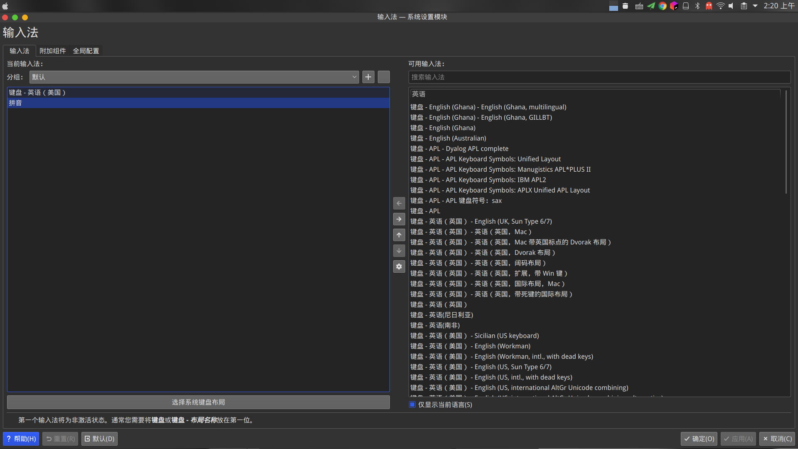

某天下午，我在Telegram群组里受人安利Fcitx5,今晚正好有空，所以就安装了个试试，还挺好的。(抱歉，文章标题一直写错了..直到这篇博客被人看到提醒我才发现..)

<!--more-->

所需安装的软件包:
  - fciutx5 输入法基础框架主程序
  - fcitx5-chinese-addons 简体中文输入的支持，云拼音
  - fcitx5-gtk gtk 程序的支持
  - fcitx5-qt4 qt4 的支持
  - fcitx5-qt5 qt5 的支持
可能还需要：
  - kcm-fcitx 如果你用的是 KDE ，请装这个
  - fcitx5-rime 繁體中文輸入 RIME 中州韻輸入法引擎

如果你是KDE桌面环境可以直接使用kcm-fcitx5配置输入法:

~~否则将改配置文件`~/.config/fcitx5/profile`~~

** 2020-6-26 更新**

如果你不是使用的KDE桌面，你可以安装`fcitx5-config-qt`来进行配置，所以可以不使用下面创建文件的方式来配置了！但是还是要加环境变量的。

~~~
[Groups/0]
# Group Name
Name=Default
# Layout
Default Layout=us
# Default Input Method
DefaultIM=pinyin

[Groups/0/Items/0]
# Name
Name=keyboard-us
# Layout
Layout=

[Groups/0/Items/1]
# Name
Name=pinyin
# Layout
Layout=

[GroupOrder]
0=Default
~~~

__若没有`fcitx5`这个目录，则先打开一次fcitx5，再关闭，因为fcitx5关闭时会覆盖此文件。__

由于fcitx5不能自动启动，我们需要添加环境变量

将如下内容添加到`~/.xprofile`

~~~
fcitx5 &
~~~

然后再将如下内容添加到~/.pam_environment`，没有则创建

**2020-6-26更新**

正确的写法是:
~~~
GTK_IM_MODULE DEFAULT=fcitx
QT_IM_MODULE  DEFAULT=fcitx
XMODIFIERS    DEFAULT=\@im=fcitx
~~~

下面这种写法可能会出现问题:
~~~
GTK_IM_MODULE=fcitx5
XMODIFIERS=@im=fcitx
QT_IM_MODULE=fcitx5
~~~

KDE用户可以直接在`系统设置模块-自动启动`设置

默认的皮肤很丑，我们可以使用这个[fcitx5-simple-theme](https://github.com/iovxw/fcitx5-simple-theme)

**2020-6-26更新**

有更多的皮肤包可以使用啦！只需要安装`fcitx5-material-color`这个包即可体验到类似Windows10输入法的样式。

然后你就可以把fcitx4给删了...

